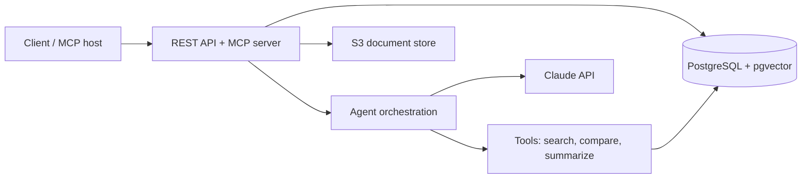

# Document Change Intelligence
 
Redline, Feed it two versions of a long governing document and it tells you **what changed, what was quietly softened or removed, and whether it matters** — with citations to the exact passage on both sides.
 
**Status:** In active development. See [Roadmap](#roadmap).
 
---
 
## The problem
 
Long governing documents get revised constantly. Annual filings, regulatory rules, terms of service, insurance policies, vendor contracts. The revisions matter, and finding them is manual work.
 
Keyword search does not solve this. The changes that matter most are rewordings, softened hedges, and quietly dropped paragraphs — cases where the vocabulary barely moves but the meaning does. A person ends up reading two hundred pages side by side to find four sentences that changed.
 
This service does that comparison and reports only what is material, with the source text from both versions attached so the answer can be verified rather than trusted.
 
**Demo corpus:** two consecutive SEC 10-K filings, because they are public domain and freely available. The system is domain agnostic — the same pipeline handles FERC and NERC rules, CMS and HIPAA guidance, contracts, or policy documents.
 
**Example query:**
 
> What risk disclosures changed between Acme's 2024 and 2025 10-K, and which changes are material?
 
---
 
## How it works
 

 
Documents are ingested with their structure intact, so sections survive as first-class records rather than collapsing into undifferentiated text. Two versions of the same document are aligned section by section, matching on headings first and falling back to embedding similarity when a section was renamed.
 
A cheap text diff finds candidate changes, and only those candidates are sent to the model for a materiality judgment. That ordering keeps cost proportional to what actually changed rather than to document length.
 
---
 
## Tech stack
 
| Layer | Choice |
|---|---|
| Runtime | Node.js (see `.nvmrc`), TypeScript, ES modules |
| API | Express 5, Zod validation on every input |
| Data | PostgreSQL, pgvector for embeddings |
| Storage | Amazon S3 |
| AI | Claude API via the Vercel AI SDK |
| Tooling | Model Context Protocol server |
| Testing | Jest, Supertest, promptfoo evals in CI |
| Ops | Docker, AWS, GitHub Actions, Pino structured logging |
 
---
 
## Getting started
 
### Prerequisites
 
- Node — the version in `.nvmrc` (run `nvm use`)
- PostgreSQL 16+ with the `pgvector` extension, or Docker
- An Anthropic API key
### Setup
 
```bash
nvm use
npm install
cp .env.example .env   
npm run dev
```
 
The API starts on the port set in `.env` (default 3000).
 
### Scripts
 
| Command | What it does |
|---|---|
| `npm run dev` | Start with hot reload |
| `npm run build` | Compile TypeScript to `dist/` |
| `npm run typecheck` | Type check without emitting |
| `npm test` | Run the test suite |
 
---
 
## API
 
| Method | Path | Description |
|---|---|---|
| `GET` | `/health` | Service health check |
| `POST` | `/documents` | Register a document and upload a version |
| `GET` | `/documents` | List documents (paginated) |
| `GET` | `/documents/:id` | Fetch a single document with its versions |
| `DELETE` | `/documents/:id` | Remove a document |
 
Endpoints for comparison, retrieval, and the agent are added in later phases and documented as they land.
 
All errors return a consistent shape:
 
```json
{
  "error": {
    "code": "VALIDATION_FAILED",
    "message": "Request body did not match the expected schema",
    "details": []
  }
}
```
 
---
 
## MCP server
 
The same comparison tools are exposed over [Model Context Protocol](https://modelcontextprotocol.io/), so the service can be used directly from Claude Desktop, an editor, or any MCP-compatible client rather than only through its own UI.
 
Setup instructions land with the implementation in Phase 4.
 
---
 
## Design notes
 
Decisions worth explaining, recorded as they are made.
 
**Sections are first-class.** Chunking a filing into fixed-size windows destroys the structure that makes cross-version alignment possible. Sections are extracted during ingestion and chunks never span a section boundary.
 
**Diff before inference.** Text comparison is nearly free and model calls are not. Candidates are found deterministically, and the model is only asked the question it is uniquely good at: does this change matter.
 
**Retrieved content is untrusted input.** Source documents are third-party text, so they are a viable indirect prompt injection vector. Retrieved passages are delimited and marked as data rather than instructions. See `SAFETY.md`.
 
**Evals gate prompt changes.** The system is non-deterministic, so "it worked when I tried it" is not evidence. Prompt and retrieval changes run against a scored eval set in CI.

---

## License
 