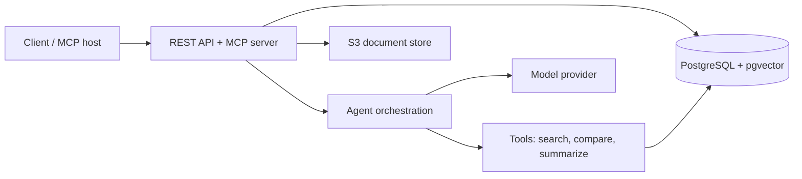

# Redline

Feed it two versions of a long governing document and it reports **what changed, what was quietly softened or removed, and whether it matters**, citing the exact passage on both sides.

> **In active development.** Built in the phases below; each completed phase
> ships as a tagged release, so [Releases](https://github.com/Bwebbb26/Redline/releases)
> is the current status.

---

## The problem

Long governing documents get revised constantly. Annual filings, regulatory rules, terms of service, insurance policies, vendor contracts. The revisions matter and finding them is manual work.

Keyword search does not solve this. The changes that matter most are rewordings, softened hedges, and quietly dropped paragraphs, cases where the vocabulary barely moves but the meaning does. Someone ends up reading two hundred pages side by side to find the four sentences that changed.

This service does that comparison and reports only what is material, with the source text from both versions attached so the answer can be verified rather than trusted.

**The demo question it has to answer:** what risk-factor language did Constellation soften or remove between its FY2024 and FY2025 10-K, and which of those changes are material?

### Why this is not another PDF chatbot

Comparing two versions of a long document is a harder retrieval problem than answering a question about one. You are aligning corresponding sections across two documents rather than fetching the best-matching passage, and sections that align to nothing are themselves a finding.

It also takes several steps rather than one model call: locate both versions, align sections, compare, judge materiality, summarize. That is what makes an agent the right shape here instead of a single call wearing a costume.

---

## Demo corpus

Ten SEC 10-K filings from five issuers, each with both 2024 and 2025, in two sectors: Constellation and Exelon in energy, Franklin Resources, T. Rowe Price, and BlackRock in asset management. One unpaired BlackRock 10-Q is included deliberately as a negative fixture, to test form-type filtering and the no-counterpart path.

The corpus is **frozen on purpose**. Evaluation needs a fixed input set, otherwise a failing eval is ambiguous: did the prompt regress, or did the data change? The pipeline itself has no knowledge of filing types, filers, or years. SEC filings are the demo because they are public and free. The same system points at FERC and NERC rules, CMS and HIPAA guidance, contracts, or policy documents.

Manifest with source URLs and cover-page dates: [`docs/corpus.json`](docs/corpus.json).

---

## Build phases

| Phase | Scope                                                          |
| ----- | -------------------------------------------------------------- |
| Setup | Repo, TypeScript, Express, corpus, manifest                    |
| 1     | REST API: documents resource, Zod validation, error handling   |
| 2     | PostgreSQL, schema with document versions, migrations, seed    |
| 3     | Auth, pagination, Jest and Supertest suite, structured logging |
| 4     | Docker, AWS deploy, GitHub Actions CI/CD                       |
| 5     | Claude API, streaming, versioned prompts, cost logging         |
| 6     | Ingestion, pgvector embeddings, section alignment, diff engine |
| 7     | Eval set scored in CI, citation checking, injection guardrails |
| 8     | Agent loop, MCP server, demo                                   |

---

## Running it

Requires Node 24 (pinned in `.nvmrc`) and npm. No database yet — phase 1 keeps
documents in memory, so `DATABASE_URL` only has to be present, not reachable.

```bash
nvm use
npm install
cp .env.example .env
npm run dev
```

```bash
curl -i localhost:3000/health
```

```bash
curl -i -X POST localhost:3000/documents \
    -H "Content-Type: application/json" \
    -d '{"filer":"BlackRock, Inc.","cik":"0002012383","form":"10-K","periodEnd":"2025-12-31","sourceUrl":"https://www.sec.gov/Archives/edgar/data/0002012383/000095017025026584/blk-20251231.htm"}'

curl -i localhost:3000/documents
```

| Command             | What it does                  |
| ------------------- | ----------------------------- |
| `npm run dev`       | Start with hot reload         |
| `npm run build`     | Compile TypeScript to `dist/` |
| `npm run typecheck` | Type check without emitting   |

### API

| Method   | Path             | What it does                  | Success                      | Errors       |
| -------- | ---------------- | ----------------------------- | ---------------------------- | ------------ |
| `GET`    | `/health`        | Liveness check                | `200` `{ status, uptime }`   | —            |
| `POST`   | `/documents`     | Register a document           | `201` `{ data: document }`   | `400`, `422` |
| `GET`    | `/documents`     | List registered documents     | `200` `{ data: [document] }` | —            |
| `GET`    | `/documents/:id` | Fetch one document            | `200` `{ data: document }`   | `400`, `404` |
| `DELETE` | `/documents/:id` | Remove a document             | `204` no body                | `400`, `404` |

`:id` is a UUID the server generates on create. A document is a record describing a
filing, not the filing itself — the documents in `data/` are not read until phase 6.

#### Request body — `POST /documents`

| Field       | Type   | Constraint             | Example                     |
| ----------- | ------ | ---------------------- | --------------------------- |
| `filer`     | string | non-empty              | `Constellation Energy Corp` |
| `cik`       | string | exactly 10 digits      | `0001868275`                |
| `form`      | string | non-empty              | `10-K`                      |
| `periodEnd` | string | ISO date, `YYYY-MM-DD` | `2024-12-31`                |
| `sourceUrl` | string | `http` or `https` URL  | `https://www.sec.gov/...`   |

`id` is server-owned. Any `id` sent in the request body is ignored, never stored.

### Error shape

Every error response in the app has one shape, built in a single place. No route
constructs one by hand. The shape is [RFC 9457 Problem Details](https://www.rfc-editor.org/rfc/rfc9457),
served as `application/problem+json`:

```json
{
  "type": "about:blank",
  "title": "Not Found",
  "status": 404,
  "detail": "Document not found"
}
```

**`400` vs `422`.** `400` means the request was malformed — unparseable JSON, a field
of the wrong type, a missing required field, or an `:id` that is not a UUID. `422`
means the body was well-formed but carried values that failed a rule. Validation
failures add an `errors` array with one entry per offending field:

```json
{
  "type": "about:blank",
  "title": "Unprocessable Entity",
  "status": 422,
  "detail": "Invalid input",
  "errors": [
    {
      "code": "invalid_format",
      "format": "regex",
      "path": ["cik"],
      "message": "CIK must be 10 digits"
    },
    {
      "code": "invalid_format",
      "format": "url",
      "path": ["sourceUrl"],
      "message": "Invalid URL"
    }
  ]
}
```

---

## Intended architecture

This is the design the build is working toward, not what runs today.


```mermaid
flowchart LR
    A[Client / MCP host] --> B[REST API + MCP server]
    B --> C[(PostgreSQL + pgvector)]
    B --> D[S3 document store]
    B --> E[Agent orchestration]
    E --> F[Model provider]
    E --> G[Tools: search, compare, summarize]
    G --> C
```

Documents are ingested with their structure intact, so sections survive as first-class records rather than collapsing into undifferentiated text. Two versions of the same document are aligned section by section, matching on heading text first and falling back to embedding similarity when a section was renamed.

A cheap text diff finds candidate changes, and only those candidates are sent to a model for a materiality judgment. That ordering keeps cost proportional to what actually changed rather than to document length.

**Stack:** TypeScript, Node.js, Express 5, Zod, PostgreSQL with pgvector, S3, Claude API behind a provider-agnostic interface, Model Context Protocol, Jest and Supertest, promptfoo, Docker, AWS, GitHub Actions, Pino.

---

## Design notes

The design decisions the build commits to, and why.

**Sections are first-class.** Chunking a filing into fixed-size windows destroys the structure that makes cross-version alignment possible. Sections get extracted during ingestion and chunks never span a section boundary.

**Diff before inference.** Text comparison is nearly free and model calls are not. Candidates get found deterministically, and the model is only asked the question it is uniquely good at: does this change matter.

**Versions are ordered by date, not by label.** `document_versions` carries a real `period_end` alongside a human label, because not every filer runs on a calendar year. Franklin's fiscal year ends September 30 while the other four end December 31, so `BEN_10K_2024` and `CONSTELLATION_10K_2024` cover different twelve months. Sorting on the label would be a silent bug.

**Nothing outside the store layer knows how data is stored.** Route files never import a database client. That is what makes the phase 2 swap from an in-memory array to PostgreSQL a change to one file rather than a rewrite.

**Retrieved content is untrusted input.** Source documents are third-party text, which makes them a viable indirect prompt injection vector. Retrieved passages get delimited and marked as data rather than instructions, and output shape is validated before anything is returned.

**Evals gate prompt changes.** The system is non-deterministic, so "it worked when I tried it" is not evidence. Prompt and retrieval changes run against a scored eval set in CI, including citation accuracy checked deterministically so a fabricated source fails the build.

---

## Notes

`NOTES.md` is a running log of what clicked and what confused me during the build. It is kept in the open on purpose.
